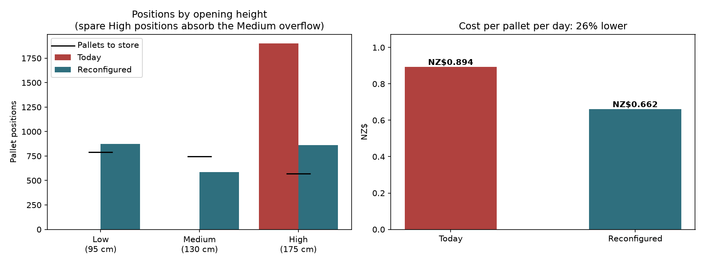
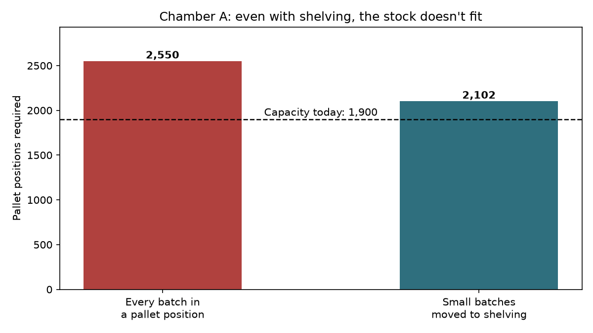

# Warehouse Capacity Analysis — 3PL Client Mobilisation & Rack Reconfiguration

A third-party logistics warehouse is taking on a new client: a pharmaceutical distributor with 600 products. Before the stock moves in, the warehouse has to answer four questions:

1. **Is the client's product data usable, and how big is each pallet?**
2. **How much space does their stock actually need?**
3. **Where should each product be stored, and how often should it be counted?**
4. **The stock doesn't fit — can the racking be redesigned so it does?**

This project answers all four in Python, using synthetic data modelled on a real client mobilisation and racking reconfiguration I carried out in a pharmaceutical distribution centre.

---

## Key results

| | Before | After |
|---|---|---|
| Pallet positions in the temperature-controlled chamber | 1,900 | **2,318** (+22%) |
| Shelving bins for small batches and pick faces | 0 | **600** |
| Vertical fill of rack openings | 56% | **74%** |
| Storage cost per pallet per day | NZ$0.894 | **NZ$0.662** (−26%) |

The reconfiguration changes 104 of 190 bays, costs about NZ$126,000, and pays back in roughly five months compared with overflowing stock to external storage.



---

## The problem

The client holds 2,344 CBM of stock. Volume isn't the constraint — **positions** are.

Pharmaceutical storage keeps **one batch per pallet position** so every batch can be traced, recalled and rotated by expiry date. A batch of three cartons therefore occupies a full pallet position. Across the client's range, that rule means the stock would need 4,293 positions averaging just 0.55 CBM each, when a full pallet holds 0.87 CBM.

Moving small batches to shelving helps, but the main chamber still comes up short — and it has no shelving at all.



---

## Approach

| Notebook | Question | Main findings |
|---|---|---|
| [01 — Pallet build & master data](notebooks/01_pallet_build.ipynb) | Is the product data usable? How big is each pallet? | 30 SKUs (5%) had master data errors: 18 fixed internally, 12 returned to the client. 31 pallets exceed the 750 kg rack limit. |
| [02 — Storage requirement](notebooks/02_storage_requirement.ipynb) | How much space does the stock need, and does it fit? | 570 small batches would take 13% of positions while holding under 2% of volume. The main chamber is 202–650 positions short. NZ$6.9M of stock expires within six months. |
| [03 — ABC & slotting](notebooks/03_abc_slotting.ipynb) | Where should each product go? How often should it be counted? | 27% of SKUs generate 80% of picks. Separate velocity and value ABC classifications drive slotting and a cycle count programme of about 53 counts a week. |
| [04 — Rack reconfiguration](notebooks/04_rack_reconfiguration.ipynb) | Can the racking be redesigned to fit? | Testing 660 feasible bay combinations, the minimum-disruption option adds 418 positions and 600 shelving bins, cutting cost per pallet per day by 26%. |

### Method highlights

- **Master data validation** — five checks, including recalculating carton volume from dimensions and testing whether the supplier's cases-per-layer physically fits the pallet in either orientation.
- **Partial pallets are sized individually** — the last pallet of a batch is shorter, which matters when matching pallets to opening heights.
- **Two ABC classifications** — velocity (order lines) for slotting, value (sales) for cycle count frequency — because a cheap product can be picked constantly and an expensive one can barely move.
- **Exhaustive search over bay configurations** — every split of 190 bays between four bay types is tested against the stock profile with a 10% growth buffer, then the option that changes the fewest bays is chosen.

---

## Data

All data is **synthetic**, generated by [`src/generate_data.py`](src/generate_data.py) with a fixed random seed so every run is identical:

- **`sku_master.csv`** — 600 SKUs across 13 principals, with carton dimensions, weights and supplier pallet builds, including deliberately planted master data errors
- **`order_lines.csv`** — 52,000 order lines over four months from pharmacies, hospitals and distributors
- **`inventory_snapshot.csv`** — batch-level stock on hand, including FOC, samples, expired and damaged stock

Product descriptions use generic (non-proprietary) medicine names. All company, principal and customer names are fictional. Costs are illustrative. No client data is included.

---

## Tech stack

Python · pandas · NumPy · Matplotlib · Jupyter · openpyxl

---

## Run it yourself

```bash
git clone https://github.com/lasikaharshana/warehouse-capacity-analysis.git
cd warehouse-capacity-analysis
pip install -r requirements.txt
python src/generate_data.py
```

Then run the notebooks in order, 01 to 04. Each one writes the file the next one needs. Excel summaries and charts are saved to `outputs/`.

```
├── data/          generated data and intermediate files
├── notebooks/     the four analysis notebooks
├── outputs/       charts and Excel reports
└── src/           data generator
```

---

## About

**Lasika Warakapitiya** — inventory and supply chain professional with over ten years in FMCG distribution, third-party logistics and pharmaceutical supply chains. MITx MicroMasters in Supply Chain Management. Based in Tauranga, New Zealand.

[LinkedIn](https://www.linkedin.com/in/lasika-warakapitiya-38aa4731)
